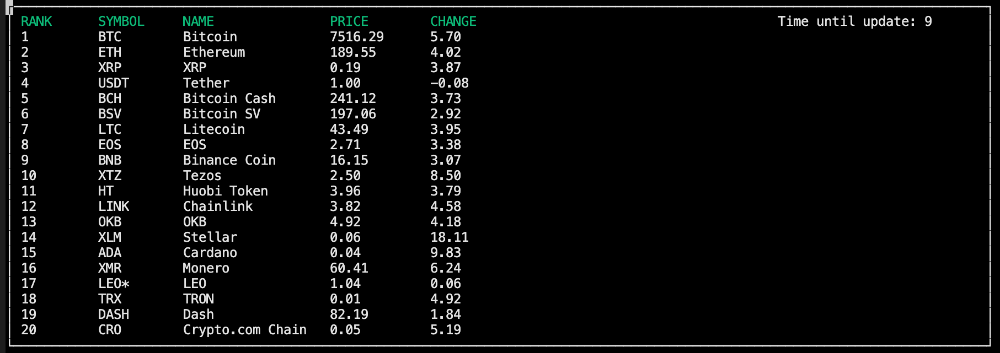

# CppND-Capstone-Crypto-Price-Viewer

This is my final project for the [Udacity C++ Nanodegree Program](https://www.udacity.com/course/c-plus-plus-nanodegree--nd213). 

This project is using *curl* library to call [coinranking api](https://coinranking.com/) to get crypto coins data, parse it using *nlohmann_json* library and then display it in the console using *ncurses* library. Data is grouped into 5 columns: rank, symbol, name, price, change.

Project is organized of 3 classes, 1 namespace and maip.cpp. Namespace NCursesDisplay is for displaying crypto coins list data to the console using ncruses lib. The data is updated every 10 seconds. Class CurlHandle is for handling GET http response and storing the response data. Class CryptoCoin is for storing single coin data (rank, symbol, name, price, change). Class Controller is using CurlHandle to get the data from api, then parse it and store to vector of type CryptoCoin. Controller class instance is created in the main.cpp and then passed as reference to NCursesDisplay namespace.

## Dependencies for Running Locally
* cmake >= 2.8
  * All OSes: [click here for installation instructions](https://cmake.org/install/)
* make >= 4.1 (Linux, Mac), 3.81 (Windows)
  * Linux: make is installed by default on most Linux distros
  * Mac: [install Xcode command line tools to get make](https://developer.apple.com/xcode/features/)
  * Windows: [click here for installation instructions](http://gnuwin32.sourceforge.net/packages/make.htm)
* gcc/g++ >= 5.4
  * Linux: gcc / g++ is installed by default on most Linux distros
  * Mac: same deal as make - [install Xcode command line tools](https://developer.apple.com/xcode/features/)
  * Windows: recommend using [MinGW](http://www.mingw.org/)
* nlohmann_json >= 3.2
  * All OSes: [click here for installation instructions](https://github.com/nlohmann/json#package-managers)
* CURL
  * All OSes: check [curl website](https://curl.haxx.se/)
* NCurses
  * Linux: [installation instructions](https://www.cyberciti.biz/faq/linux-install-ncurses-library-headers-on-debian-ubuntu-centos-fedora/)
  * Mac: [brew installation](https://formulae.brew.sh/formula/ncurses) 
  * Windows: check guide [here](http://gnuwin32.sourceforge.net/packages/ncurses.htm)

## Instructions

1. Clone the project repository: `https://github.com/tasmanx/CppND-Capstone-Crypto-Price-Viewer.git`
2. Make a build directory in the top level directory: `mkdir build && cd build`
3. Compile: `cmake .. && make`
4. Run it: `./CryptoPriceViewer`.

## Rubric points

* The project demonstrates an understanding of C++ functions and control structures (curl_handle.cpp)
* The project uses Object Oriented Programming techniques (controller.h, lines: 12, 16)
* Classes use appropriate access specifiers for class members (crypto_coin.h, lines: 8-28)
* Class constructors utilize member initialization lists (crypto_coin.h, line 11)
* Classes abstract implementation details from their interfaces (crypto_coin.h, line 13-18)
* Classes encapsulate behavior (curl_handle.h)
* The project makes use of references in function declarations (ncurses_display.h, line 10)
* The project uses move semantics to move data, instead of copying it, where possible (controller.cpp, line 21)
* The project uses smart pointers instead of raw pointers (curl_handle.h, line 11)
